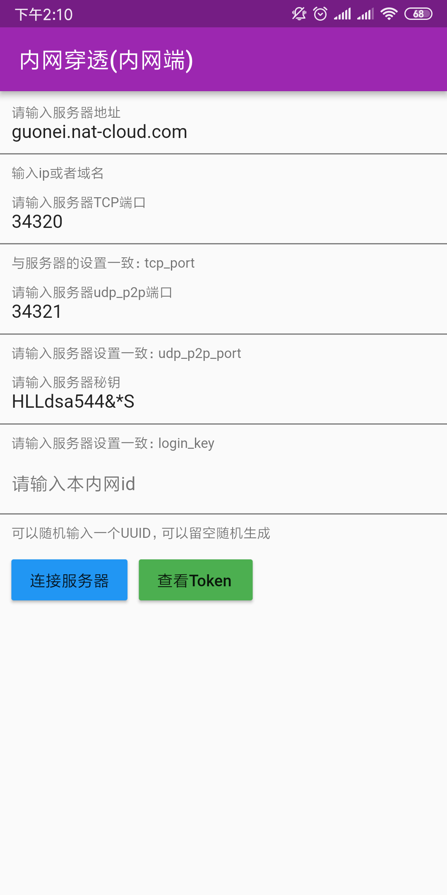

# GateWay(物联网、私有云、内外穿透网关)

### 用来管理本网络的设备，访问本网络的私有云和远程访问本网络的端口

#### 下载：
##### https://github.com/OpenIoTHub/GateWay/releases
#### 访问工具下载：
##### https://github.com/OpenIoTHub/OpenIoTHub/releases
nat-cloud client

## Getting Started

This project is a starting point for a Flutter application.

A few resources to get you started if this is your first Flutter project:

- [Lab: Write your first Flutter app](https://flutter.io/docs/get-started/codelab)
- [Cookbook: Useful Flutter samples](https://flutter.io/docs/cookbook)

For help getting started with Flutter, view our 
[online documentation](https://flutter.io/docs), which offers tutorials, 
samples, guidance on mobile development, and a full API reference.
